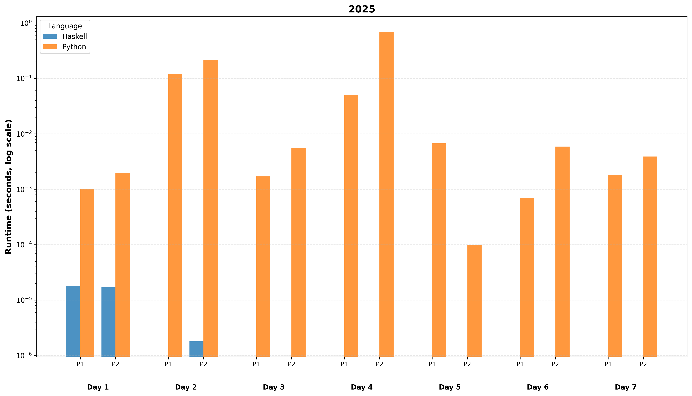

## About

I always partake in the great [Advent of Code](https://adventofcode.com/) event. In the past I either haven't published solves or put them in disparate repositories, and figured it's time to just have one main repo to work in every year.

I almost always do the inital solve in Python but occasionally branch out and practice other languages.

All solution code is **entirely my own**. Spoilers within, of course.

## Runtime comparison by day / problem / language

